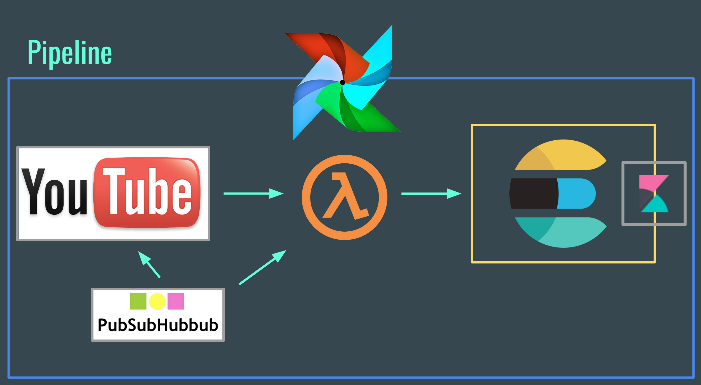

# Summary

I used an Elasticsearch cluster to store and analyze YouTube data by the minute via AWS Lambda and PubSubHubbub.

1. [Prerequisites](#prerequisites)
2. [Overview](#overview)
3. [Quickstart](#quickstart)

# Prerequisites

Maven, AWS SAM CLI, PostgreSQL, Elasticsearch with Kibana plugin, Airflow

# Overview

 

# Quickstart

## Deploy Serverless Lambda

    mvn clean package
    sam package --template-file sam.yaml --s3-bucket your-bucket --s3-prefix serverless --output-template-file target/deploy.yaml
    sam deploy --template-file target/deploy.yaml --stack-name your-stack --capabilities CAPABILITY_IAM

## Postgres

Read text file, print table, or subscribe to YouTube channels

Remember to fill in your callback URL from the output of your AWS Cloud Formation Stack

    java -cp target/insight-1.0-SNAPSHOT.jar postgres.Postgres addChannels
    java -cp target/insight-1.0-SNAPSHOT.jar postgres.Postgres print
    java -cp target/insight-1.0-SNAPSHOT.jar postgres.Postgres subscribe

## Elasticsearch

Update and evaluate the videos in your Elasticsearch database

    java -cp target/insight-1.0-SNAPSHOT.jar elasticsearch.Elasticsearch

Alternatively use Airflow scheduler with task in `dags` directory
